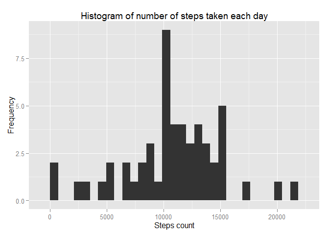
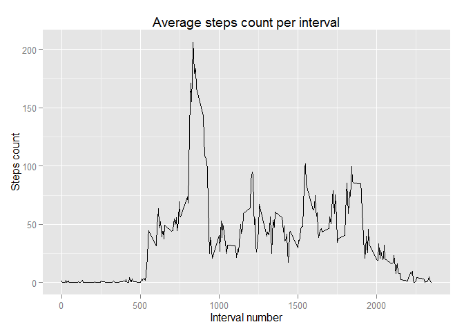
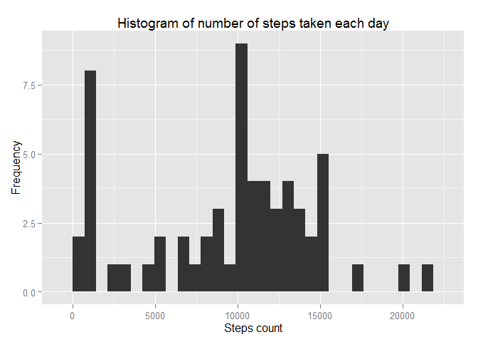
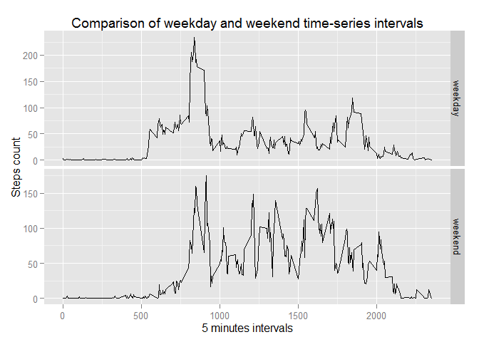

# Reproducible Research: Peer Assessment 1
Filip Wójcik  
Saturday, March 07, 2015  

## Necessary configuration and preparation

First of all we need to require all necessary libraries


```r
library(ggplot2)
library(grid)
```

In order to prevent R from using default locale of the system, we need to force R to use english weekdays names


```r
Sys.setlocale("LC_TIME", "C")
weekdays(Sys.Date()+0:6)
```


### Reusable functions:

In this assignment, some portions of code can be used several times. E.g. grouping data by day and/or interval will be used at least twice. The following secion describes functions, that we will be using in the next qustions and assignments.

#### Grouping by day

The following function will group data by day. By grouping we mean aggregation of number of steps, taken during all intervals in this day.


```r
group_data_by_day <- function(data){
  clean.data <- na.omit(data)
  grouped.data <- aggregate(x = clean.data$steps, by = list(clean.data$date), FUN = sum)
  names(grouped.data) <- c("day", "steps.count")
  grouped.data
}
```

### Calculating and plotting mean of total number of steps per day

The following two functions take data, group it by day, and build histogram of it. We will reuse this function in two places - when calculating menan number of steps for the WHOLE data, and later - when calculating mean number of steps for the data with imputed values.
Because functions will be reused - title is configurable.


```r
mean_total_number_of_steps_per_day <- function(data, title="Histogram of number of steps taken each day"){
  grouped.data <- group_data_by_day(data)
  plt <- plot_total_number_of_steps_per_day(grouped.data, title)
  print(plt)
  mean.of.steps <- mean(x=grouped.data$steps.count)
  median.of.steps <- median(x=grouped.data$steps.count)
  print(paste("Mean of steps count: ", mean.of.steps))
  print(paste("Median of steps count: ", median.of.steps))
}

plot_total_number_of_steps_per_day <-function(grouped.data, title="Histogram of number of steps taken each day"){
  qplot(
    x=grouped.data$steps.count,
    geom="histogram",
    xlab="Steps count",
    ylab="Frequency",
    main=title)
}
```

#### Grouping by interval number

The following function aggregates the steps count by the interval number. It takes all days, and extracts intervals from it, then groups them together and perform some operation on number of steps per interval. 
Pay attention to the parameter: **aggregation_function** - it can be set to mean/median/mode/sum or whatever else we need. 


```r
group_data_by_interval <- function(data, aggregation_function=mean){
  clean.data <- na.omit(data)
  grouped.data <- aggregate(x = clean.data$steps, by = list(clean.data$interval), FUN=aggregation_function)
  names(grouped.data) <- c("interval", "steps.count")
  grouped.data
}
```


## Loading and preprocessing the data

First part of the assignment is reading data. I assume, that the data file is placed just next to this R script. It allows us use loading/processing functions without any additional efforts.

The following function reads data from file, and changes the "Date" column from character to date type: 


```r
load_data <- function(){
  data <- read.csv("activity.csv", sep=",", header=TRUE)
  data$date <- as.Date(data$date, "%Y-%m-%d")
  data
}

data <- load_data()
```

## What is mean total number of steps taken per day?

Getting the information from this part's question requires from us several steps:

1. Grouping data by day (using the function defined earlier)
2. Making a histogram of the results

This task can be achieved by the reusable function, that we have introduced earlier: **mean_total_number_of_steps_per_day**.


```r
mean_total_number_of_steps_per_day(data)
```

 

```
## [1] "Mean of steps count:  10766.1886792453"
## [1] "Median of steps count:  10765"
```

## ## What is the average daily activity pattern?

1. First part of answer will require to aggregate data by time interval. We can do this using the previously introduced function:


```r
data.grouped.by.interval <- group_data_by_interval(data)
```

2. Plot grouped data:


```r
qplot(
  x = data.grouped.by.interval$interval, 
  y=data.grouped.by.interval$steps.count, 
  geom="line") + 
xlab("Interval number") + 
ylab("Steps count") +
ggtitle("Average steps count per interval")
```

 

3. Which 5-minute interval, on average across all the days in the dataset, contains the maximum number of steps?


```r
max.interval <- data.grouped.by.interval$interval[which.max(data.grouped.by.interval$steps.count)]
print(paste("Maximal interval is: ", max.interval))
```

```
## [1] "Maximal interval is:  835"
```


## Imputing missing values

### Cleaning data

The following function performs imputing missing steps values on selected rows from original data. It contains several steps:
1. Divide data into two subsets:
  a with missing steps values
  b with present steps values
2. Take data with present values
  a. group data by interval (using function defined earlier)
  b. as aggregation method, use median (because mean is too biased and - in general - better option is to use median on imputing values)
3. Take data with missing values: for each interval - take value from the data in pont 1) and use it to fil missing value
4. Merge data together - data originally containing steps values, and data with filled steps values


```r
clean_data <- function(data){
  are.steps.na <- is.na(data$steps)
  mean.steps.by.interval <- group_data_by_interval(data, aggregation_function = median)
  no.na.data <- data[!are.steps.na, ]
  na.data <- data[are.steps.na, ]
  
  # join data with steps == na with data with median steps count per interval
  clean.data <- merge(x = na.data, y = mean.steps.by.interval, by="interval")
  
  # remove old steps column, which contained nulls
  clean.data <- clean.data[, colnames(clean.data)[colnames(clean.data) != "steps"]]
  
  # rename steps.count column to steps
  colnames(clean.data)[colnames(clean.data) == "steps.count"] <- "steps"
  
  # bind data together and return as a whole
  rbind(no.na.data, clean.data)
}
```

### Building clean data set

Using the function defined above, we can build the clean data set:


```r
clean.data <- clean_data(data)
```

### Histogram of cleaned data

Right now, we can build the histogram of total number of steps taken each day using the cleaned data. We will do this, using exactly the same functions as we used before


```r
mean_total_number_of_steps_per_day(clean.data)
```

 

```
## [1] "Mean of steps count:  9503.86885245902"
## [1] "Median of steps count:  10395"
```

## Are there differences in activity patterns between weekdays and weekends?

To compare daily acitvity patterns we do the follwing:
1. Take the cleaned data
2. Add information about the day of week data using the following function

```r
add_day_of_week_data <- function(data){
  within(
    data=data,
    expr={
     weekend <- ifelse(
       test = weekdays(date) %in% c("Saturday", "Sunday"), 
       yes = TRUE, 
       no = FALSE)     
    })
}
```
2. Add information if the day is a weekday or weekend
3. Group data from both categories (weekday/weekend) by the interval
4. Plot the panel


```r
  week.data <- add_day_of_week_data(data)
  is.weekend <- (week.data$weekend == TRUE)
  weekend.intervals.grouped <- group_data_by_interval(week.data[is.weekend,])
  weekend.intervals.grouped['type'] <- 'weekend'
  weekday.intervals.grouped <- group_data_by_interval(week.data[!is.weekend,])
  weekday.intervals.grouped['type'] <- 'weekday'
  intervals.grouped <- rbind(weekend.intervals.grouped, weekday.intervals.grouped)
  ggplot(
    aes(x=interval, y = steps.count),
    data=intervals.grouped) + 
    geom_line() + 
    facet_grid(type ~ ., scales="free") +
    xlab("5 minutes intervals") + 
    ylab("Steps count") + 
    ggtitle("Comparison of weekday and weekend time-series intervals")
```

 
